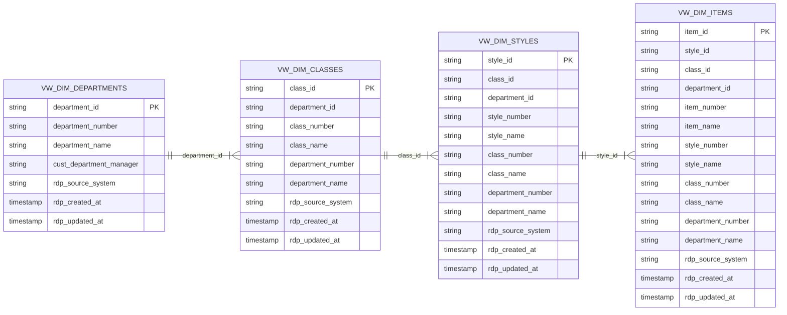

# Product Hierarchy — ERD

```mermaid
%%{init: {"er": {"layoutDirection": "RL"}} }%%
erDiagram
  direction LR
  "VW_DIM_DEPARTMENTS" {
    string department_id PK
    string department_number
    string department_name
    string cust_department_manager
    string rdp_source_system
    timestamp rdp_created_at
    timestamp rdp_updated_at
  }
  "VW_DIM_CLASSES" {
    string class_id PK
    string department_id
    string class_number
    string class_name
    string department_number
    string department_name
    string rdp_source_system
    timestamp rdp_created_at
    timestamp rdp_updated_at
  }
  "VW_DIM_STYLES" {
    string style_id PK
    string class_id
    string department_id
    string style_number
    string style_name
    string class_number
    string class_name
    string department_number
    string department_name
    string rdp_source_system
    timestamp rdp_created_at
    timestamp rdp_updated_at
  }
  "VW_DIM_ITEMS" {
    string item_id PK
    string style_id
    string class_id
    string department_id
    string item_number
    string item_name
    string style_number
    string style_name
    string class_number
    string class_name
    string department_number
    string department_name
    string rdp_source_system
    timestamp rdp_created_at
    timestamp rdp_updated_at
  }
  "VW_DIM_DEPARTMENTS" ||--|{ "VW_DIM_CLASSES": department_id
  "VW_DIM_CLASSES" ||--|{ "VW_DIM_STYLES": class_id
  "VW_DIM_STYLES" ||--|{ "VW_DIM_ITEMS": style_id
```
